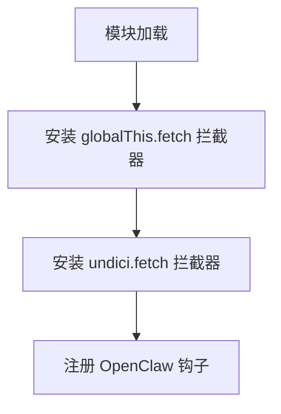
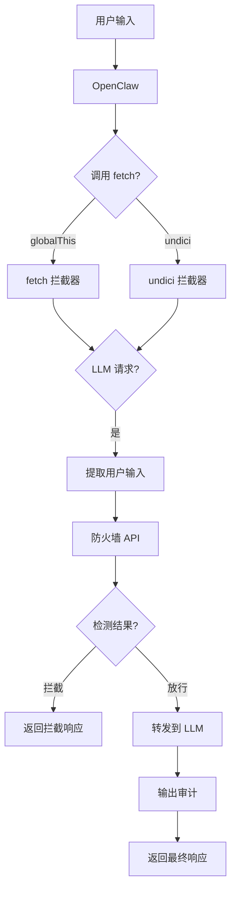
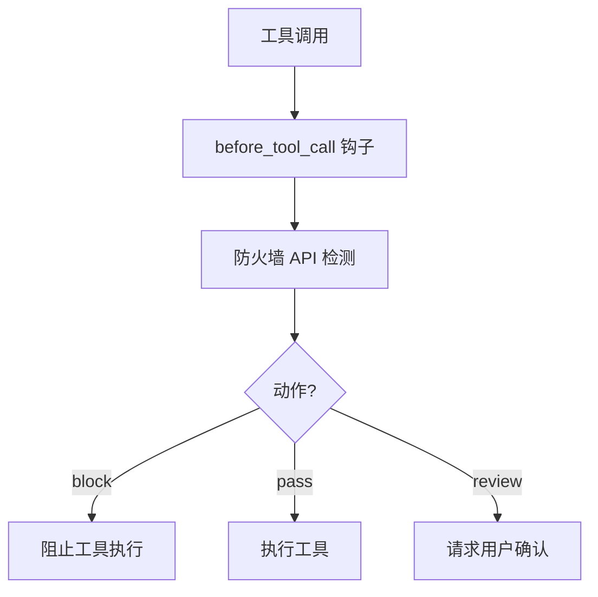
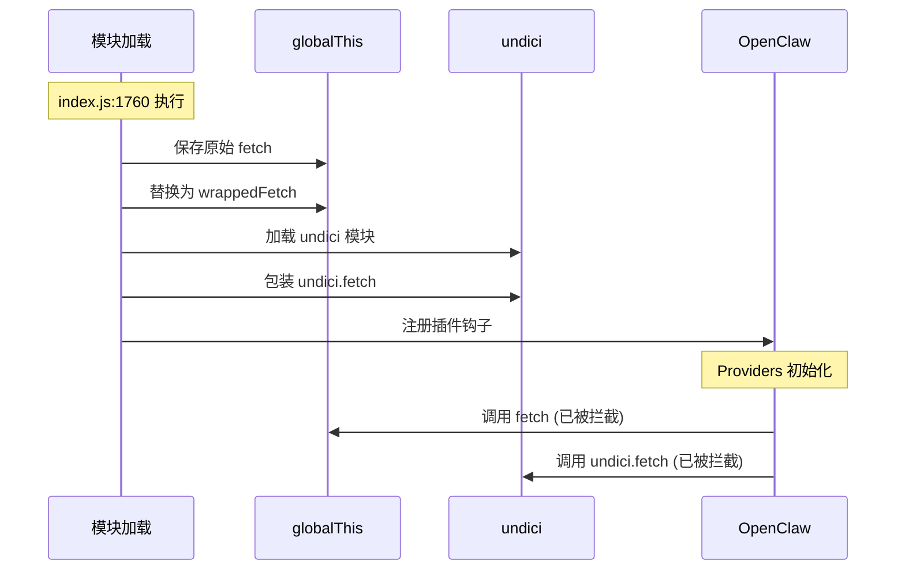
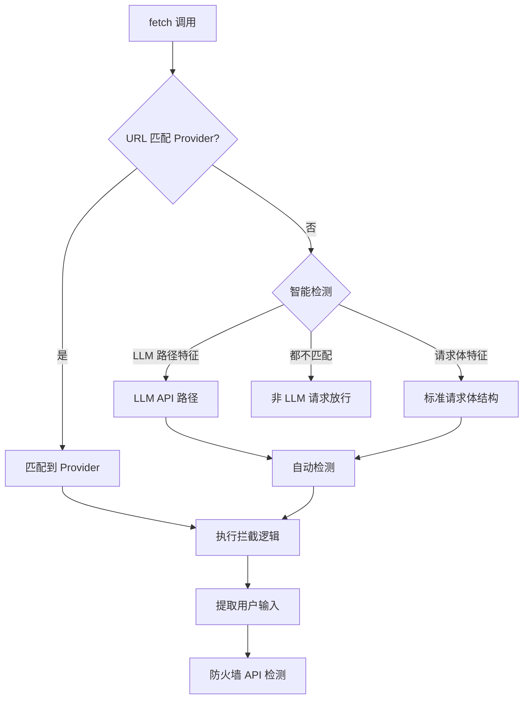
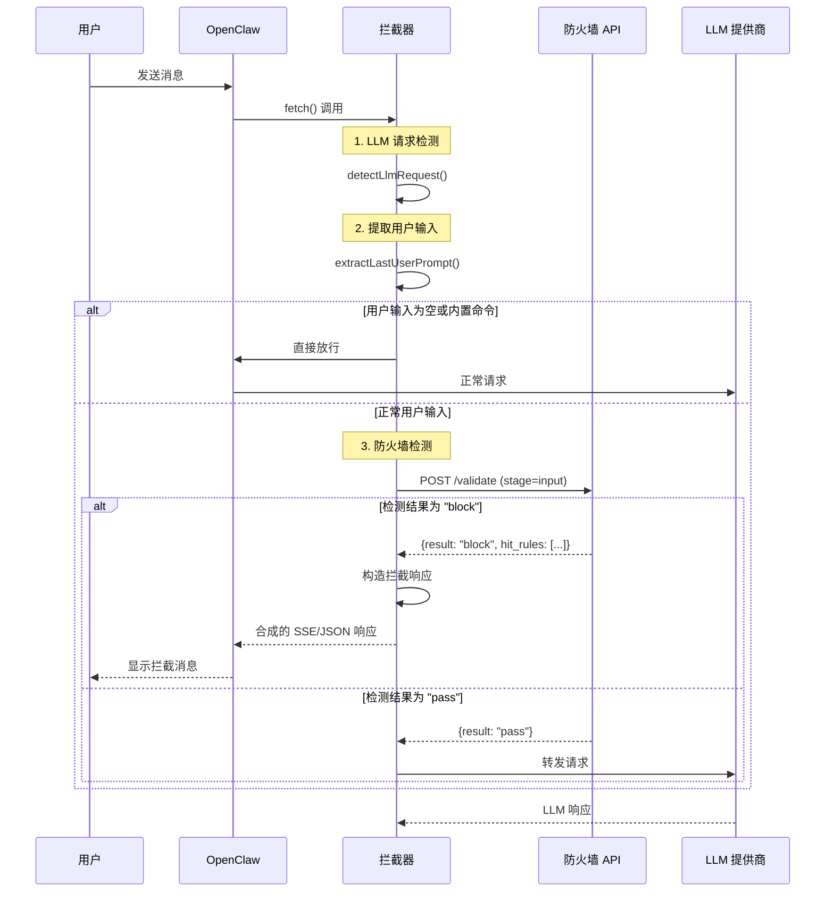
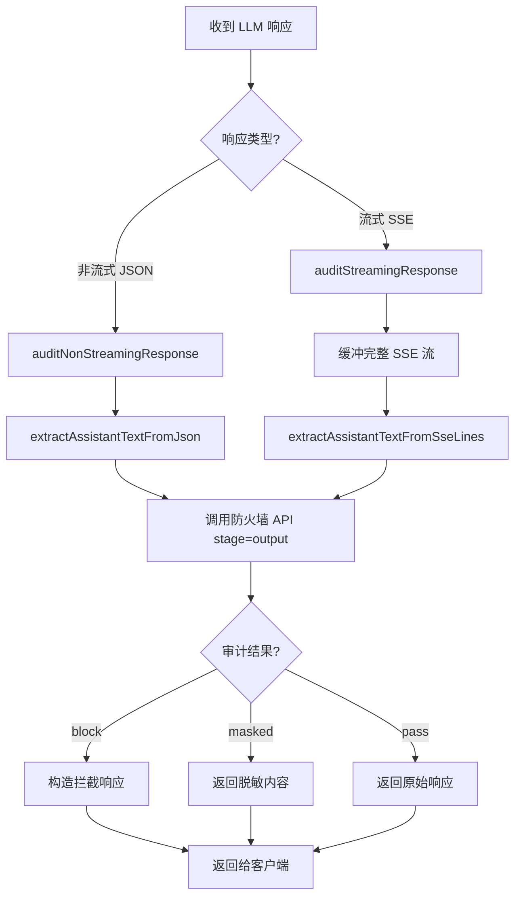
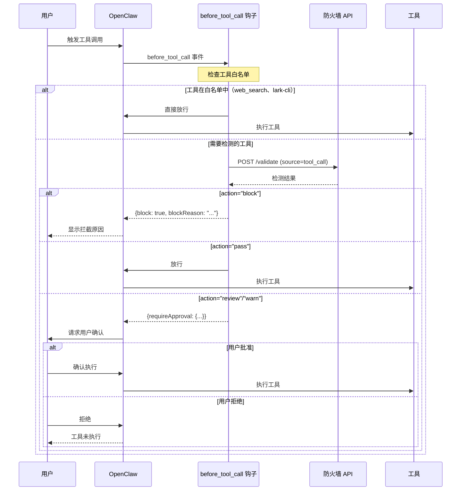
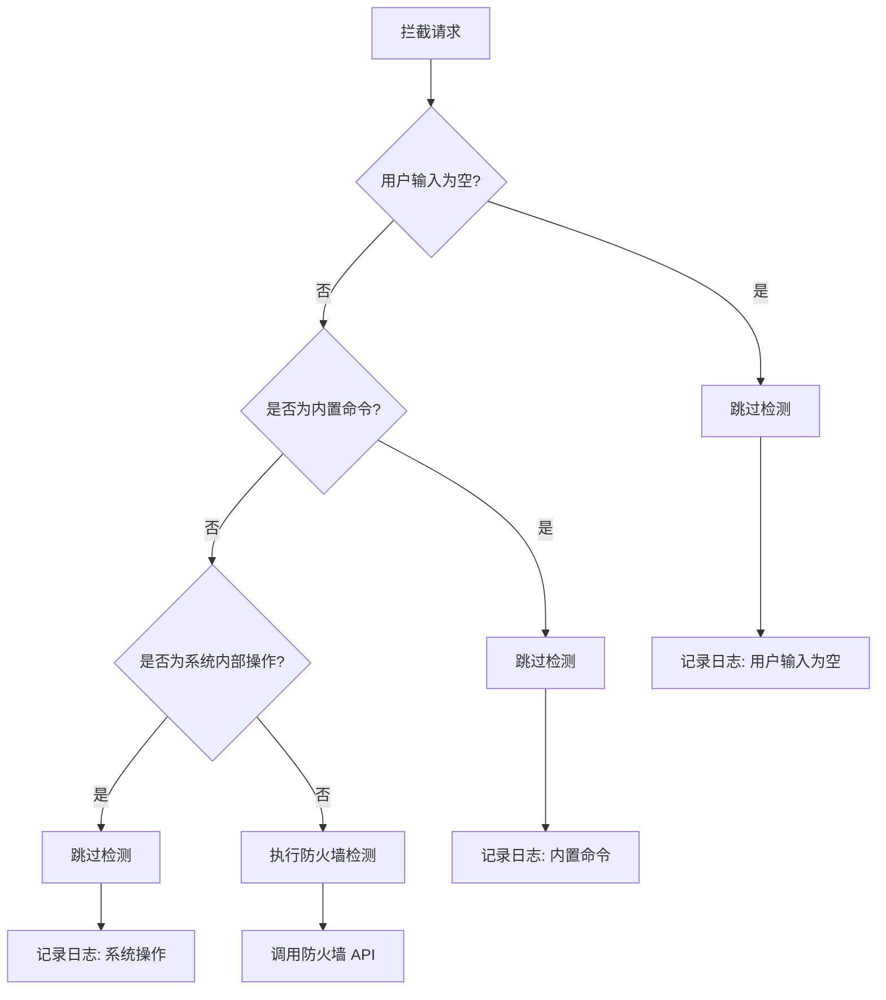
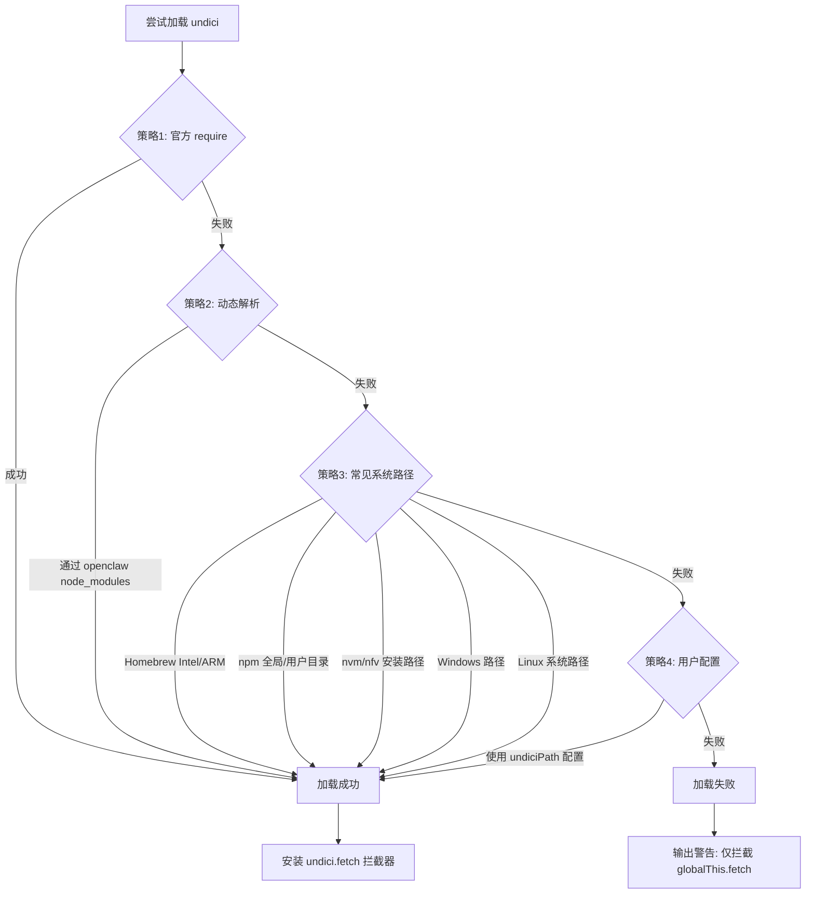

# tomzang_plungin

OpenClaw 安全内容检测插件，通过防火墙 API 对用户输入进行实时安全检测和拦截。

## 主要功能

- **实时内容检测**：拦截所有 LLM 请求，提取用户输入内容，调用防火墙 API 进行安全检测
- **工具调用审计**：在工具调用执行前（`before_tool_call`）对工具名称和参数进行安全检测；执行后（`after_tool_call`）将调用命令与执行结果送审留存（fail-open，仅告警记录，不干预结果）
- **智能拦截**：检测到敏感内容时，自动构造合规的拦截响应（支持 SSE 流式和非流式），阻止请求到达 LLM
- **内置命令跳过**：自动跳过以 `/` 开头的内置命令和系统内部操作（如 `/reset`、摘要生成等），避免误检
- **命中规则展示**：拦截时以 Markdown 表格形式展示命中的安全规则（rule_code、rule_name、description）

## 工作原理

```
用户输入 → fetch 拦截 → 提取用户 prompt → 防火墙 API 检测
  ├─ 安全 → 正常转发请求到 LLM
  └─ 不安全 → 构造拦截响应返回给客户端

工具调用 → before_tool_call → 防火墙 API 检测
  ├─ 安全 → 正常执行工具
  └─ 不安全 → 返回 block 拦截

工具结果 → after_tool_call → 防火墙 API 送审（source=tool_result）
  └─ 命中风险 → 仅记录告警日志，不干预已产生的结果
```

## 架构与实现

### 整体架构

插件采用**全局拦截**策略，在模块加载时（`index.js:1760`）立即安装 fetch 拦截器，确保在 OpenClaw providers 初始化之前完成包装，从而捕获所有 LLM API 调用。

#### 插件初始化流程

在模块加载时，插件会按顺序完成初始化：



#### 请求处理流程

当用户发起请求时，数据流经过以下处理链路：



#### 工具调用守卫流程

工具调用在执行前会经过安全检查：



### 全局 Fetch 拦截机制

插件在模块加载时通过 `installGlobalFetchInterceptor()` 函数（`index.js:1398-1760`）完成拦截器安装：

1. **保存原始引用**：将原始 `globalThis.fetch` 保存到 `globalOriginalFetch` 变量
2. **包装 fetch 函数**：创建 `wrappedFetch` 函数，在调用原始 fetch 前后插入拦截逻辑
3. **双重拦截**：同时拦截 `globalThis.fetch` 和 `undici.fetch`（OpenClaw 使用的 HTTP 客户端）



### 双层 LLM 检测策略

插件使用**双重检测**机制确保所有 LLM API 请求都被捕获：



#### 1. Provider URL 匹配

通过 `getProviderBaseUrls()` 函数（`index.js:1068`）从 OpenClaw 配置中读取所有已配置的 providers，提取其 `baseUrl`，然后通过 `matchProviderByUrl()` 进行 URL 前缀匹配。

#### 2. 智能检测

当 Provider 匹配失败时，使用 `detectLlmRequest()` 函数（`index.js:1166`）通过请求特征智能识别：

- **URL 路径特征**：检测常见 LLM API 路径（`/chat/completions`、`/v1/messages` 等）
- **请求体特征**：解析请求 JSON，检测标准格式（`messages` 数组、`model` 字段等）

支持检测的 LLM 提供商包括：OpenAI、Anthropic、Azure OpenAI、Google Gemini、Ollama 等。

## 请求流程

### 输入验证流程

当用户发送消息时，插件通过拦截器捕获 LLM API 请求，执行以下流程：



### 输出审计流程

对于通过输入验证的请求，插件会对 LLM 返回的响应进行二次审计：



#### 流式响应处理

对于 SSE 流式响应（`index.js:946`），插件会：

1. **完整缓冲**：读取并缓冲所有 SSE chunks
2. **提取文本**：解析 SSE 数据，提取完整的助手回复
3. **审计检测**：将完整文本发送到防火墙 API
4. **响应处理**：
   - `result="block"`：返回构造的 SSE 拦截响应
   - `masked_content` 存在：返回脱敏后的 SSE 流
   - `result="pass"`：重建原始 SSE 流返回

#### 非流式响应处理

对于 JSON 响应（`index.js:854`），插件会：

1. **解析响应**：提取 `choices[0].message.content` 或 `content[0].text`
2. **审计检测**：发送到防火墙 API
3. **内容替换**：如果返回 `masked_content.response`，替换原响应中的助手文本

### 工具调用守卫流程

通过 OpenClaw 的 `before_tool_call` 钩子实现工具调用前的安全检查：



工具调用守卫的关键点：

- **白名单机制**：`web_search` 和 `lark-cli` 工具自动放行（`index.js:1278`）
- **参数序列化**：工具参数通过 `JSON.stringify()` 序列化后发送到防火墙 API
- **动作映射**：
  - `block` → 直接阻止，返回 `block: true`
  - `pass` → 直接放行
  - `review`/`warn` → 触发用户二次确认流程

## 绕过机制

插件设计了多种跳过防火墙检测的场景，确保不影响正常使用：

### 绕过决策流程



### 内置命令白名单

以下内置命令自动跳过防火墙检测（`index.js:424-441`）：

```javascript
var BUILT_IN_COMMANDS = [
  "/new",      // 新建会话
  "/reset",    // 重置会话
  "/help",     // 帮助信息
  "/clear",    // 清空上下文
  "/config",   // 配置管理
  "/exit",     // 退出会话
  "/quit",     // 退出程序
  "/sessions", // 会话列表
  "/models",   // 模型列表
  "/providers",// 提供商列表
  "/agent",    // 代理命令
  "/session",  // 会话命令
  "/continue", // 继续对话
  "/version",  // 版本信息
  "/debug",    // 调试模式
  "/verbose"   // 详细模式
];
```

**设计原因**：这些是 OpenClaw 的内置命令，用于系统管理，不涉及向 LLM 发送用户生成的内容，无需安全检测。

### 系统内部操作模式

以下模式匹配的系统内部操作也会跳过检测（`index.js:468-475`）：

```javascript
var SYSTEM_INTERNAL_PATTERNS = [
  /A new session was started via \/new/i,
  /A new session was started via \/reset/i,
  /Based on this conversation, generate a short/i,
  /generate a short \d+-\d+ word filename slug/i,
  /session was started via \//i,
  /session was reset/i
];
```

**设计原因**：这些是 OpenClaw 系统自动生成的消息（如会话初始化、文件名生成请求），不是用户直接输入的内容，无需检测。

### 综合判断逻辑

`shouldSkipFirewall()` 函数（`index.js:486`）综合判断是否跳过：

```javascript
function shouldSkipFirewall(text) {
  return isBuiltInCommand(text) || isSystemInternalRequest(text);
}
```

**执行顺序**：
1. 首先检查是否为内置命令（精确匹配白名单）
2. 然后检查是否为系统内部操作（正则模式匹配）
3. 两者都不满足时，执行防火墙检测

## 实现细节

### 单文件结构

插件采用单文件设计（`index.js`），所有逻辑集中在一个文件中，便于维护和理解。文件按功能划分为多个区域，用 `───` 注释标记：

```javascript
// ─── 配置解析 ───           (lines 1-50)
// ─── 日志 ───                (lines 52-91)
// ─── 防火墙API调用 ───       (lines 93-227)
// ─── 用户输入提取 ───        (lines 229-421)
// ─── Fetch 工具函数 ───      (lines 490-541)
// ─── 拦截提示语生成 ───      (lines 543-576)
// ─── 响应构造 ───            (lines 578-671)
// ─── 输出内容提取与替换 ───  (lines 673-843)
// ─── 输出审计 ───            (lines 845-1062)
// ─── Provider 匹配 ───       (lines 1064-1094)
// ─── LLM 请求智能识别 ───    (lines 1096-1174)
// ─── 插件主体 ───            (lines 1176-1380)
// ─── 全局拦截器状态 ───      (lines 1382-1394)
// ─── 全局 fetch 包装函数 ─── (lines 1396-1757)
```

### 全局状态管理

插件使用模块级全局变量来维护状态（`index.js:1382-1394`）：

```javascript
var globalOriginalFetch = null;      // 原始 fetch 引用
var globalConfig = {                  // 全局配置
  firewallUrl: "",
  authKey: "",
  blockMessage: DEFAULT_BLOCK_MESSAGE,
  debug: false,
  timeout: DEFAULT_TIMEOUT_MS
};
var globalApi = null;                 // OpenClaw API 实例
var interceptorInstalled = false;      // 拦截器安装标志
var fetchCallId = 0;                   // fetch 调用计数器
```

**设计原因**：这些变量在模块加载时初始化，在拦截器函数中访问，确保拦截逻辑可以获取最新配置。

### Undici 多策略加载

OpenClaw 使用 `undici` 作为 HTTP 客户端，插件需要拦截 `undici.fetch`。由于 `undici` 的安装位置不确定，插件采用多策略加载（`index.js:1544-1628`）：



**策略优先级**：
1. **官方推荐**：直接 `require('undici')`
2. **动态解析**：通过 `require.resolve('openclaw')` 定位 openclaw 目录，加载其 node_modules 中的 undici
3. **常见路径**：尝试各系统和包管理器的常见安装位置
4. **用户配置**：使用 `undiciPath` 配置项指定的路径

### 响应格式兼容

插件兼容多种 LLM API 响应格式：

#### OpenAI 格式
```json
{
  "choices": [{
    "message": {"content": "助手回复文本"}
  }]
}
```

#### Anthropic 格式
```json
{
  "content": [{"type": "text", "text": "助手回复文本"}]
}
```

插件通过 `extractAssistantTextFromJson()` 函数（`index.js:676`）自动识别并提取文本内容。

## 安全考虑

### Fail-Open 策略

插件采用 **Fail-Open**（失败放行）安全策略：

```javascript
// 防火墙 API 调用失败时
catch (e) {
  logError("firewall", "api_call_failed", errorDetails);
  // 接口异常时放行，避免阻断正常请求
  return { action: "pass", result: "pass", error: String(e) };
}
```

**设计原因**：
- 防火墙服务不可用时，不应影响正常业务
- 网络抖动或临时故障不应导致所有请求被阻断
- 通过日志记录故障，便于运维监控

### 超时处理

插件为防火墙 API 调用设置超时（默认 3000ms）：

```javascript
var controller = new AbortController();
var timeoutId = setTimeout(function () {
  controller.abort();
}, config.timeout);
```

超时后请求被中止，返回 `action: "pass"` 放行该请求。

### 错误处理

插件对多种错误场景进行容错处理：

| 错误场景 | 处理方式 | 日志级别 |
|---------|---------|---------|
| 防火墙 API 连接失败 | 放行请求 | ERROR |
| 防火墙 API 返回非 200 | 放行请求 | WARN |
| 防火墙 API 响应格式错误 | 放行请求 | WARN |
| 用户输入提取失败 | 使用请求体前 2000 字符 | DEBUG |
| SSE 流读取失败 | 返回已缓冲的内容 | WARN |
| 响应体替换失败 | 构造完整响应返回 | WARN |

## 配置项

在 `~/.openclaw/openclaw.json` 的 `plugins.entries.tomzang_plungin.config` 中配置：

```json
{
  "firewallUrl": "http://your-firewall-host:port/api/firewall/openclaw/validate",
  "authKey": "your-auth-key",
  "blockMessage": "自定义拦截提示语",
  "debug": "false",
  "timeout": 3000,
  "undiciPath": "/path/to/undici"
}
```

### 配置说明

| 配置项 | 类型 | 必填 | 默认值 | 说明 |
|--------|------|------|--------|------|
| `firewallUrl` | string | **是** | 无 | 防火墙 API 地址，用于内容安全检测 |
| `authKey` | string | **是** | 无 | 防火墙 API 认证密钥 |
| `blockMessage` | string | 否 | `当前请求包含敏感关键字，已被安全组件拦截` | 自定义拦截提示语（当无命中规则时显示） |
| `debug` | string / boolean | 否 | `false` | 是否启用调试模式，开启后会输出详细日志。支持布尔值或 `"true"`/`"false"` 字符串 |
| `timeout` | number | 否 | `3000` | 防火墙 API 超时时间（毫秒） |
| `undiciPath` | string | 否 | 自动检测 | 自定义 undici 模块路径，用于拦截请求（未指定时自动检测） |

> **重要**：`firewallUrl` 和 `authKey` 为必填项。如果未配置，插件将在启动时上报错误，并跳过所有防火墙检测功能（仅保留基本的生命周期钩子日志记录）。

## 防火墙 API 接口

插件调用防火墙 API 时发送如下格式的 POST 请求：

```json
{
  "auth_key": "配置中的 authKey",
  "session_id": "会话标识",
  "trace_id": "追踪ID",
  "stage": "input",
  "source": "text",
  "content_type": "text",
  "content": {
    "prompt": "待检测的用户输入内容",
    "response": "",
    "image": ""
  }
}
```

### 请求参数说明

| 参数 | 类型 | 说明 | 示例值 |
|------|------|------|--------|
| `auth_key` | string | 认证密钥，来自配置 | `"my-auth-key"` |
| `session_id` | string | 会话标识符 | `"session-openclaw"` |
| `trace_id` | string | 追踪 ID，格式为 `trace-{timestamp}-{callId}` | `"trace-1234567890-1"` |
| `stage` | string | 检测阶段：`input`（输入）、`output`（输出） | `"input"` |
| `source` | string | 内容来源：`text`（用户输入 / LLM 输出文本）、`tool_call`（工具调用）、`tool_result`（工具调用结果）、`skill`（Skill 调用） | `"text"` |
| `content_type` | string | 内容类型，目前固定为 `"text"` | `"text"` |
| `content.prompt` | string | 输入侧内容：用户提示词、工具调用命令（纯 params JSON）、skill 正文 | 用户输入内容 |
| `content.response` | string | 输出侧内容：LLM 响应内容、工具执行结果 | LLM 输出内容 |
| `content.image` | string | 图像内容（预留，当前为空） | `""` |

### 响应格式

```json
{
  "code": 200,
  "data": {
    "action": "pass",
    "result": "pass",
    "risk_level": 0,
    "violation_reason": "",
    "hit_rules": [],
    "masked_content": {
      "prompt": "",
      "response": "",
      "image": ""
    }
  }
}
```

| 字段 | 类型 | 说明 |
|------|------|------|
| `code` | number | HTTP 状态码，200 表示成功 |
| `data.action` | string | 动作：`pass`（放行）、`block`（拦截）、`review`（需确认）、`warn`（警告） |
| `data.result` | string | 结果：`pass`（通过）、`block`（拦截） |
| `data.risk_level` | number | 风险等级 0-5 |
| `data.violation_reason` | string | 违规原因描述 |
| `data.hit_rules` | array | 命中的规则列表，包含 `rule_code`、`rule_name`、`description` 等字段 |
| `data.masked_content` | object | 脱敏内容，包含 `prompt`、`response`、`image` 字段 |

当返回结果中 `result` 为 `"block"` 时，插件将拦截该请求。

## 安装

### 方式一：使用安装脚本（推荐）

仓库根目录提供了 `install.sh`，会自动下载并部署插件，写入 `~/.openclaw/openclaw.json` 中的 `plugins.entries.tomzang_plungin.config`。

```bash
./install.sh <firewallUrl> <authKey> [blockMessage] [debug]
```

参数说明：

| 位置参数 | 必填 | 对应配置项 | 说明 |
|----------|------|------------|------|
| `firewallUrl` | 是 | `firewallUrl` | 防火墙 API 地址 |
| `authKey` | 是 | `authKey` | 防火墙 API 认证密钥 |
| `blockMessage` | 否 | `blockMessage` | 自定义拦截提示语 |
| `debug` | 否 | `debug` | 是否开启调试日志，`true`/`false` |

示例：

```bash
./install.sh http://127.0.0.1:8080/api/firewall/openclaw/validate my-auth-key
```

安装与配置策略（按优先级，前者失败自动回退）：

1. **CLI 优先**：调用 `openclaw plugins install clawhub:tomzang_plungin` 完成安装，并使用 `openclaw plugins config tomzang_plungin key=value` 写入全部配置项，最后尝试 `openclaw plugins enable tomzang_plungin`。
2. **GitHub Release 回退**：当本机未安装 `openclaw` CLI 或 CLI 执行失败时，调用 GitHub API `GET /repos/nideyeye/tomzang_plungin/releases/latest` 解析最新 release，优先下载其中的 `.tar.gz` / `.tgz` / `.zip` 资产；若 release 没有资产则回退到 release 的源码 `tarball_url`（绑定在 release 对应 tag 上）。**不再使用 `main` 分支打包**。解压后部署到 `~/.openclaw/extensions/tomzang_plungin/`。可通过环境变量 `GITHUB_TOKEN` 提升 API 速率限制（私仓必填）。
3. **配置回退**：当 CLI 配置失败（或走的是 GitHub 分支）时，直接合并写入 `~/.openclaw/openclaw.json`，同时维护以下三处，确保插件不会因不在允许列表而被禁用：
   - `plugins.entries.tomzang_plungin`：写入 `enabled: true` 与配置项；
   - `plugins.allow`：将 `tomzang_plungin` 加入 allowlist（消除 `not in allowlist` 警告的关键）；
   - `plugins.load.paths`：将 `~/.openclaw/extensions/tomzang_plungin` 加入扫描路径。
4. **allowlist 兜底**：写入完成后会再次校验 `plugins.allow`，若插件仍未出现在其中，将再次执行直接写入流程进行兜底。
5. **自动备份**：已存在的插件目录与 `openclaw.json` 会先被备份为 `.bak.YYYYMMDD_HHMMSS` 后缀文件。
6. **生效方式**：完成后执行 `openclaw gateway restart` 重启网关使配置生效。

依赖：`curl`、`tar`（GitHub 回退时使用）；建议安装 `node`（用于回退路径合并 JSON；缺失时脚本会输出需手动追加的 JSON 片段）。如果已安装 `openclaw` CLI，则通常无需额外依赖。

### 方式二：手动安装

1. 设置铸盾防火墙 url `openclaw config set plugins.entries.tomzang_plungin.config.firewallUrl "${铸盾防火墙地址}"`
2. 配置对应的 key `openclaw config set plugins.entries.tomzang_plungin.config.authKey "${铸盾 openclaw key}"`
3. （可选）配置超时时间 `openclaw config set plugins.entries.tomzang_plungin.config.timeout 3000`
4. （可选）配置 undici 路径 `openclaw config set plugins.entries.tomzang_plungin.config.undiciPath "/path/to/undici"`
5. 进入插件目录，执行离线安装命令 `openclaw plugins install -l .`
6. 重启 gateway 应用 `openclaw gateway restart`
7. 开启 debug 模式 `openclaw config set plugins.entries.tomzang_plungin.config.debug true`

## 故障排查

### 常见问题

#### 1. 插件未生效

**症状**：配置完成后，敏感内容未被拦截

**排查步骤**：

1. 检查插件是否已启用：
   ```bash
   openclaw plugins list
   ```

2. 检查配置是否正确：
   ```bash
   openclaw config get plugins.entries.tomzang_plungin.config
   ```

3. 重启 OpenClaw 网关：
   ```bash
   openclaw gateway restart
   ```

#### 2. undici 拦截失败

**症状**：日志显示 `WARNING: Could not load undici module`

**解决方案**：

1. 全局安装 undici：
   ```bash
   npm install -g undici
   ```

2. 或手动指定 undici 路径：
   ```bash
   openclaw config set plugins.entries.tomzang_plungin.config.undiciPath "/path/to/undici"
   ```

#### 3. 防火墙 API 超时

**症状**：请求经常被放行，日志显示 `api_call_failed`

**解决方案**：

增加超时时间（默认 3000ms）：
```bash
openclaw config set plugins.entries.tomzang_plungin.config.timeout 5000
```

#### 4. 内置命令被拦截

**症状**：`/reset` 等命令显示被拦截

**原因**：内置命令白名单未生效，可能是 `shouldSkipFirewall()` 逻辑问题

**排查**：开启 debug 模式查看日志

### 调试模式

开启调试模式可以查看详细的拦截日志：

```bash
openclaw config set plugins.entries.tomzang_plungin.config.debug true
```

调试日志示例：

```
[tomzang_plungin] [llm] [request] callId=1 url=https://api.openai.com/v1/chat/completions provider=openai
[tomzang_plungin] [llm] [extracted_user_prompt] callId=1 promptLength=25
[tomzang_plungin] [llm] [user_prompt_preview] callId=1 preview=如何破解密码？
[tomzang_plungin] [llm] [firewall_check_start] callId=1
[tomzang_plungin] [llm] [firewall_check_result] callId=1 action=block result=block
[tomzang_plungin] [llm] [request_blocked] callId=1
```

### 日志级别

插件使用以下日志级别：

| 级别 | 用途 | 示例场景 |
|------|------|---------|
| INFO | 正常操作记录 | 拦截请求、工具调用被阻止 |
| WARN | 警告信息 | API 返回非 200、读取响应失败 |
| ERROR | 错误信息 | API 调用失败、配置缺失 |
| DEBUG | 调试信息（需开启 debug 模式） | 请求详情、提取的用户输入 |

## 许可证

MIT License
